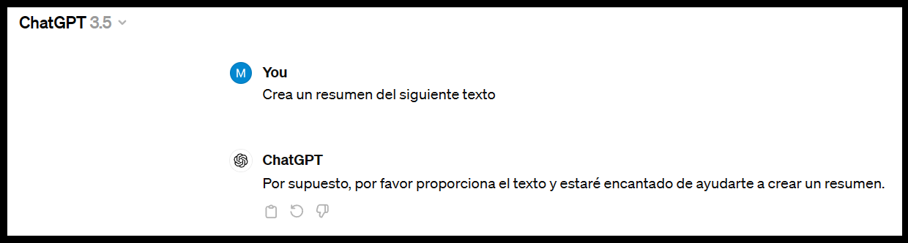
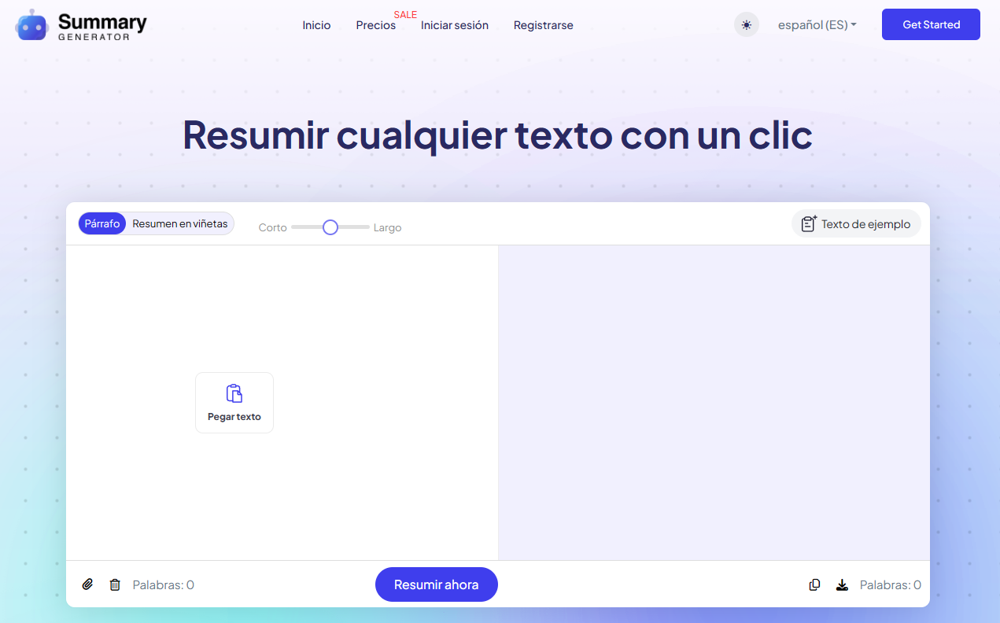
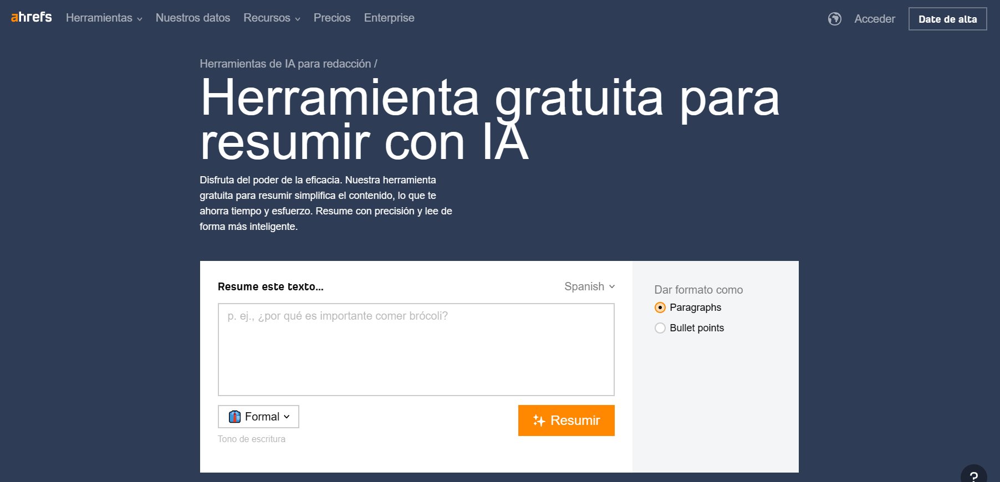
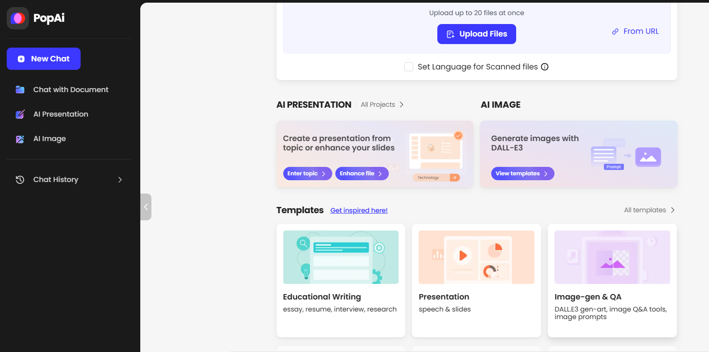
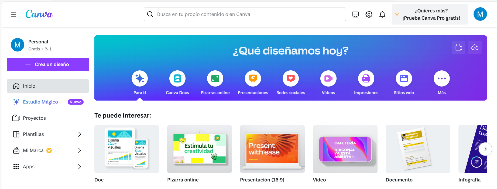
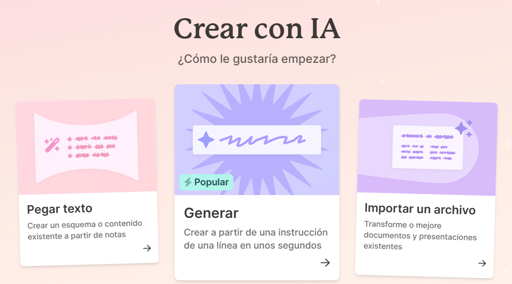
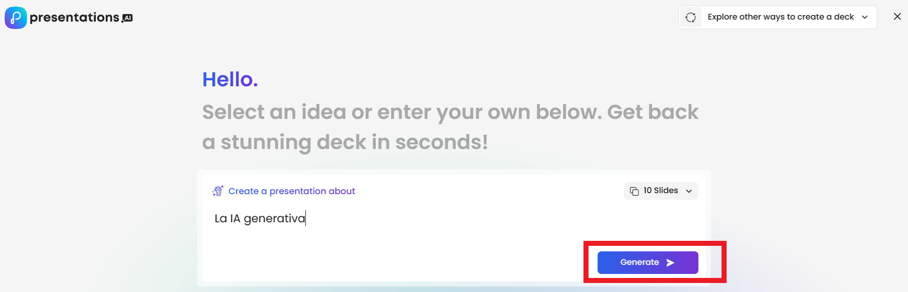
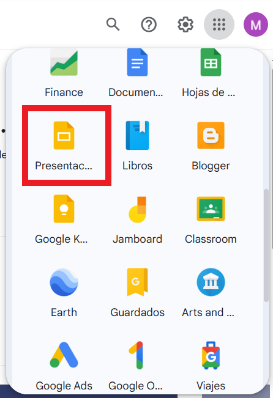
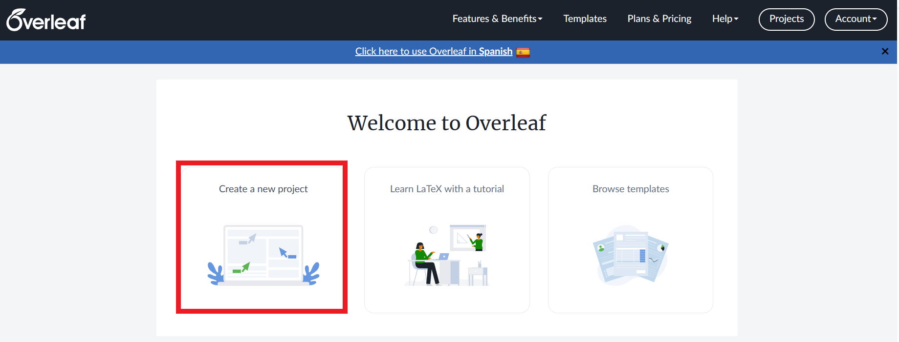

--- 
title: IA generativa resumenes y presentaciones
summary: Las IA generativas facilitan la realizacion de resúmenes y presentaciones. Utilizar esta herramientas como un asistente, agilizan muchas tareas. En educación, podemos encontrar fuentes de inspiración para el planteamiento de todo tipo de tareas.
authors:
    - Manuela Iborra
    - Jose Robledano
date: 2024-03-18
---
# Resúmenes y presentaciones

## **Resúmenes**

Las herramientas de IA para la generación de textos, también nos dan la posibilidad de resumir textos largos concretando los puntos claves y facilitando la comprensión del texto de forma más rápida.

Para la generación de resúmenes necesitamos:

- Texto para resumir que puede ser un libro, capítulo, ensayo, noticia, etc.
- Herramienta IA como ChatGPT, Gemini, etc.

{width=80%, height=80%}

!!! info "Importante"
    No debemos quedarnos directamente con el resultado sin antes leerlo y verificar que el resumen obtenido se ajusta a lo que nosotros queremos ofrecer al alumno.

### **Herramientas para la generación de resúmenes**

[Summarygenerator.io](https://summarygenerator.io/){:target="_blank"}

Es un generador de resúmenes que utiliza tecnología avanzada de IA para desglosar un contenido extenso en resúmenes más rápidos de leer y entender.

{width=80%, height=80%}

[ahref](https://ahrefs.com/es/writing-tools/summarizer){:target="_blank"}

Es una herramienta gratuita para resumir y simplificar el contenido extenso para poder facilitar la lectura.

{width=80%, height=80%}

[PopAi](https://www.popai.pro/){:target="_blank"}

PopAi es una herramienta que proporciona respuestas al instante ya que integra modotes de búsqueda, lectura de PDF y generación de Powerpoint.

{width=80%, height=80%}

[ChatPDF](https://www.chatpdf.com/){:target="_blank"}

Más que una herramienta para resumir, es una evolución personalizada de chat generativo. Se envia un fichero, y se puede preguntar sobre el contenido del documento. Podemos solicitar desde un extracto, hasta realizar preguntas concretas sobre el contenido. Las respuestas que se obtienen siempre hacen referencia al **contexto** del documento enviado.

Para utilizarlo, *NO es necesario estar registrado*. Sólo en el caso de querer tener acceso al historial, sera necesario acceder con un usuario.

{width=80%, height=80%}

## **Presentaciones**

Existen diferentes herramientas para la creación de presentaciones con IA. Estas herramientas facilitan la generación rápida de materiales educativos sin requerir esfuerzo en el diseño y formato. La IA asume gran parte del trabajo ya que ofrecen diseños personalizables y profesionales sin tener grandes conocimientos de diseño gráfico.  Las más utilizadas son:

- **Canva**: Incluye herramientas de escritura de IA en su versión gratuita. En la versión de pago Canva Pro, proporciona un diseñador de presentaciones basado en IA entre otras utilidades.

[Enlace a Canva](https://www.canva.com/){:target="_blank"}

{width=80%, height=80%}

- **Gamma App**: Herramienta para crear contenido interactivo y visual para las presentaciones, documentos y páginas Web, utilizando IA. Integra diversos elementos multimedia como GIFs, vídeos y gráficos.

[Enlace a Gamma.app](https://gamma.app/?lng=es-ES){:target="_blank"}

{width=80%, height=80%}

- **Presentations.ai**: Plataforma que utiliza IA para la creación de diapositivas, sugiere diseños, estilos de texto, gráficos y otros elementos que mejoran la presentación.

[Enlace a Presentations.ai](https://www.presentations.ai/){:target="_blank"}

{width=80%, height=80%}

- **MagicSlides**: Crea presentaciones de Google a partir de un tema, texto, vídeo o dirección Web.

[Enlace a MagicSlides](https://workspace.google.com/marketplace/app/magicslides_app_gpt_for_slides/371894645570){:target="_blank"}

{width=80%, height=80%}

Después de instalar la herramienta accedes a las presentaciones de Google:

{width=50%, height=50%}

{width=80%, height=80%}

## **Crear documento en formato PDF**

Las herramientas conversacionales como ChatGPT tienen la posibilidad de crear documentos en **LaTeX** que podemos transformar en PDF.  LaTeX es un archivo de texto plano que describe la estructura y el contenido de un documento, incluyendo elementos como el tipo de documento (artículo, libro, carta, etc.), el formato de página, el estilo de fuente, los encabezados y pies de página, las secciones y subsecciones, las citas bibliográficas, etc. Una vez que se ha escrito el código LaTeX, se compila para producir un documento PDF final con el formato deseado.

**Overleaf** es una plataforma en línea que permite a los usuarios escribir, editar, compilar y compartir documentos LaTex. Una característica importante es que permite la colaboración en tiempo real para que varios usuarios puedan trabajar juntos en el mismo documento LaTeX simultaneamente.

[Enlace a Overleaf](https://www.overleaf.com/){:target="_blank"}

Pasos:

- Registrarse en Overleaf.
- Crear un nuevo proyecto:

{width=80%, height=80%}

- Proyecto en blanco y ponerle nombre al proyecto.
- Con la herramienta ChatGPT crea un documento latex sobre el tema que quieras y copia el código.

{width=80%, height=80%}

- Borra lo que aparece en el panel de la izquierda y pega el texto anterior. Pulsa el botón Compile (Recompile). Puedes poner tu nombre o modificar lo que quieras en el panel de la izquierda. Recuerda que después de modificar debes recompilar. Una vez el documento sea de tu agrado lo puedes descargar.

